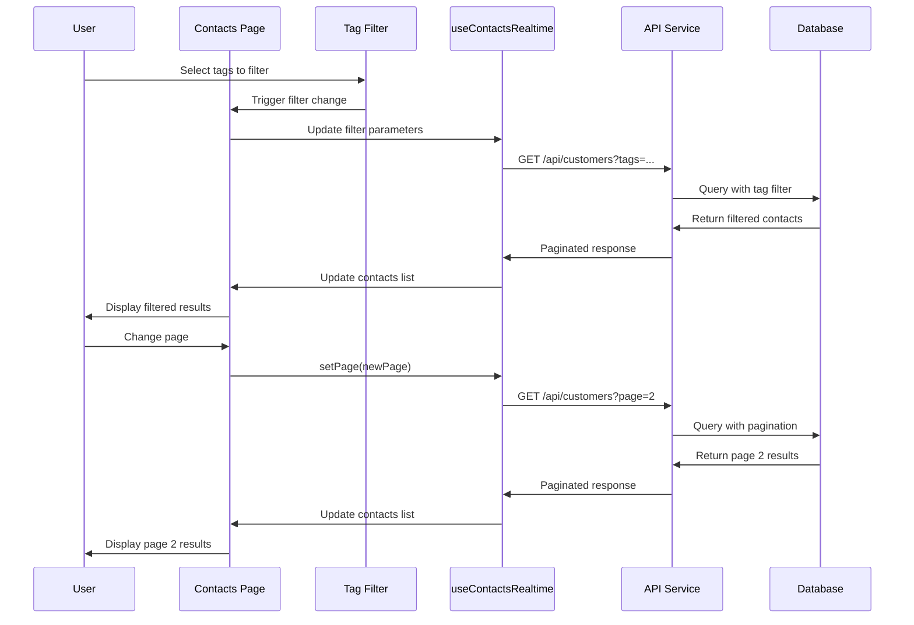
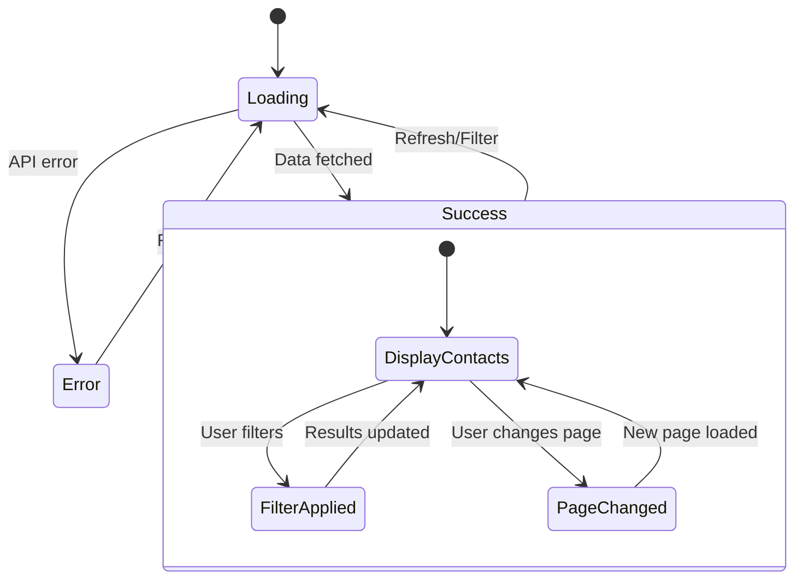
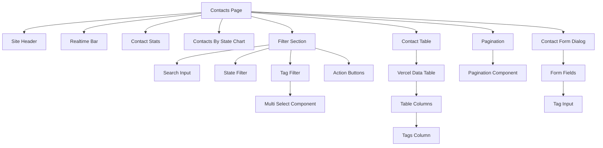
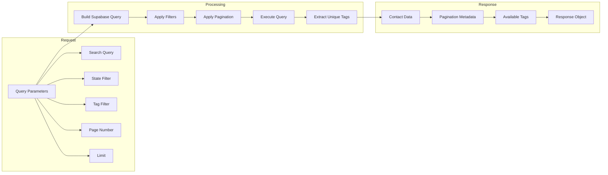
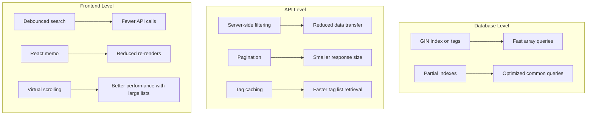
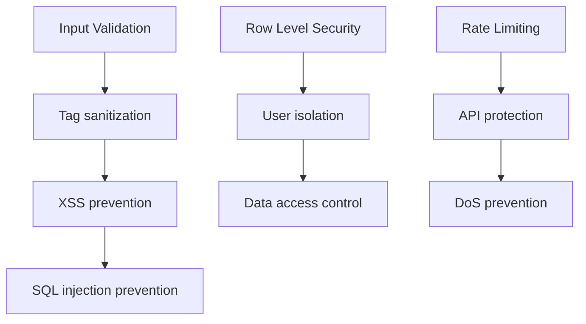

# Architecture Diagram for Tag Filtering and Pagination

## System Architecture Overview

```mermaid
graph TB
    subgraph "Frontend (React)"
        A[Contacts Page] --> B[useContactsRealtime Hook]
        A --> C[Tag Filter Component]
        A --> D[Pagination Component]
        A --> E[Contact Form]
        B --> F[API Service Layer]
        C --> F
        D --> B
        E --> G[Tag Input Component]
    end
    
    subgraph "Backend (Next.js API)"
        F --> H[GET /api/customers]
        F --> I[POST /api/customers]
        F --> J[PUT /api/customers/[id]]
        H --> K[Tag Filtering Logic]
        H --> L[Pagination Logic]
        I --> M[Tag Validation]
    end
    
    subgraph "Database (Supabase/PostgreSQL)"
        K --> N[customers Table]
        L --> N
        M --> N
        N --> O[tags: TEXT[] Field]
        N --> P[GIN Index on tags]
    end
    
    subgraph "Data Flow"
        Q[User selects tags] --> R[Filter request sent]
        R --> S[Server-side filtering]
        S --> T[Paginated response]
        T --> U[UI updates]
    end
```

## Component Interaction Flow



## Database Schema Changes

```mermaid
erDiagram
    customers {
        uuid id PK
        uuid user_id FK
        text phone
        text first_name
        text last_name
        text email
        text state
        text status
        text[] tags
        timestamp created_at
        timestamp updated_at
    }
    
    customers ||--o{ user_profiles : "belongs to"
    
    note over customers: Added tags field as TEXT[] array
    note over customers: Added GIN index on tags for performance
```

## State Management Flow



## Component Hierarchy



## API Request/Response Flow



## Performance Optimization Strategy



## Security Considerations



## Deployment Strategy

```mermaid
graph LR
    subgraph "Phase 1: Database"
        A[Run migration] --> B[Verify schema]
        B --> C[Test queries]
    end
    
    subgraph "Phase 2: Backend"
        D[Deploy API changes] --> E[Test endpoints]
        E --> F[Verify responses]
    end
    
    subgraph "Phase 3: Frontend"
        G[Deploy components] --> H[Test UI]
        H --> I[Integration testing]
    end
    
    A --> D
    D --> G