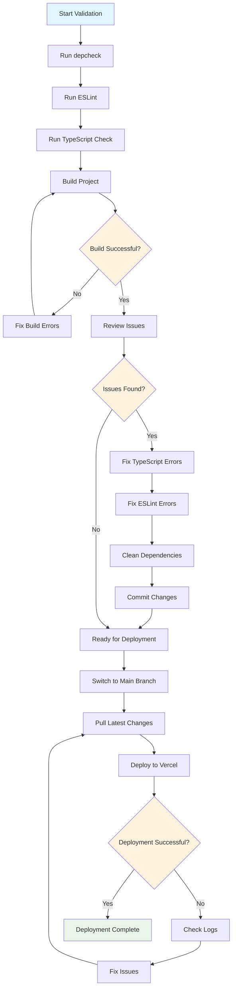

# DNwerks Deployment Workflow

## Overview
This document outlines the complete workflow from code validation to production deployment on Vercel.

## Workflow Diagram



## Detailed Steps

### Phase 1: Validation
1. **Dependency Check**: Identify unused packages
2. **Code Quality**: Run ESLint to find code issues
3. **Type Safety**: Check TypeScript compilation
4. **Build Test**: Verify project builds successfully

### Phase 2: Issue Resolution
1. **TypeScript Fixes**:
   - Property name mismatches
   - Missing module declarations
   - Edge function types
2. **ESLint Fixes**:
   - Variable declaration order
   - Impure function calls
3. **Dependency Cleanup**:
   - Remove unused packages
   - Add missing dependencies

### Phase 3: Git Management
1. **Commit Changes**: Stage and commit all fixes
2. **Branch Management**: Switch to main branch
3. **Sync Repository**: Pull latest changes

### Phase 4: Deployment
1. **Environment Setup**: Verify Vercel environment variables
2. **Deploy**: Run deployment command
3. **Verify**: Check deployment success

## Pre-Deployment Checklist

### Code Quality
- [ ] No TypeScript errors
- [ ] No ESLint errors
- [ ] Build completes successfully
- [ ] All tests pass (if applicable)

### Dependencies
- [ ] Unused dependencies removed
- [ ] Missing dependencies added
- [ ] Package.json updated

### Git Repository
- [ ] All changes committed
- [ ] On main branch
- [ ] Pushed to remote

### Environment
- [ ] Vercel project linked
- [ ] Environment variables configured
- [ ] Domain settings verified

## Deployment Commands

### Quick Deploy (Windows)
```batch
deploy-to-vercel.bat
```

### Manual Deploy
```bash
git pull origin main
vercel --prod
```

### Full Validation & Deploy
```bash
npm run type-check
npm run lint
npm run build
git add .
git commit -m "Ready for deployment"
git checkout main
git merge clean-slate
git push origin main
vercel --prod
```

## Post-Deployment Verification

1. **Check Application**: Visit deployed URL
2. **Test Key Features**:
   - User authentication
   - Campaign creation
   - Customer management
   - Admin dashboard
3. **Monitor Logs**: Check Vercel logs for errors
4. **Performance**: Verify load times

## Rollback Procedure

If deployment fails or causes issues:

```bash
# Rollback to previous commit
git checkout HEAD~1
git push origin main --force
vercel --prod

# Or rollback to specific commit
git checkout <commit-hash>
git push origin main --force
vercel --prod
```

## Environment Variables Reference

| Variable | Required | Description |
|----------|----------|-------------|
| `NODE_ENV` | Yes | Set to 'production' |
| `NEXT_PUBLIC_APP_URL` | Yes | Your Vercel app URL |
| `NEXT_PUBLIC_SUPABASE_URL` | Yes | Supabase project URL |
| `NEXT_PUBLIC_SUPABASE_ANON_KEY` | Yes | Supabase anonymous key |
| `SUPABASE_SERVICE_ROLE_KEY` | Yes | Supabase service role key |
| `TWILIO_ACCOUNT_SID` | Yes | Twilio account SID |
| `TWILIO_AUTH_TOKEN` | Yes | Twilio auth token |
| `TWILIO_PHONE_NUMBER` | Yes | Twilio phone number |
| `BITLY_ACCESS_TOKEN` | Optional | Bitly access token |
| `CRON_SECRET` | Optional | Secret for cron jobs |

## Troubleshooting Guide

### Common Issues

1. **Build Failures**:
   - Check TypeScript errors
   - Verify imports
   - Clear Next.js cache

2. **Deployment Failures**:
   - Check Vercel logs
   - Verify environment variables
   - Ensure Git is up to date

3. **Runtime Errors**:
   - Check browser console
   - Verify API endpoints
   - Check database connection

### Support Resources

- [Vercel Documentation](https://vercel.com/docs)
- [Next.js Deployment Guide](https://nextjs.org/docs/deployment)
- [Supabase Production Guide](https://supabase.com/docs/guides/platform/going-into-prod)
- [Project Documentation](./DEPLOYMENT_GUIDE.md)