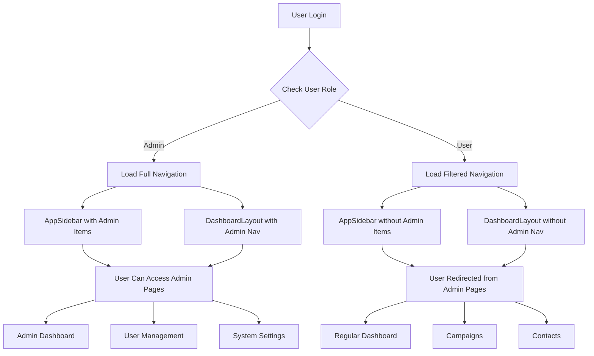
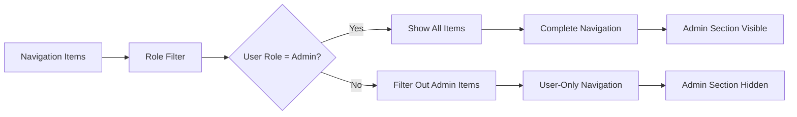
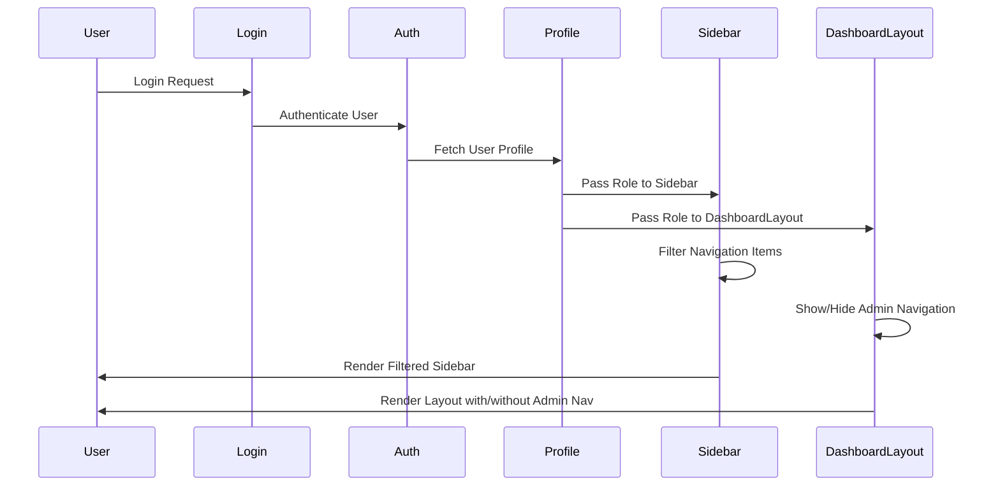
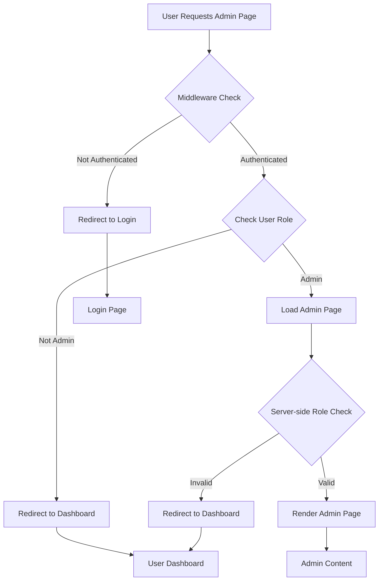

# Role-Based Navigation Implementation Flow

## System Architecture Diagram



## Navigation Filtering Logic



## Component Interaction Flow



## Admin Route Protection Flow



## Implementation Components

### 1. Navigation Data Structure
```typescript
interface NavItem {
  title: string
  url: string
  icon?: LucideIcon
  isActive?: boolean
  items?: NavItem[]
  requiresRole?: UserRole  // New property for role-based access
}
```

### 2. Role Filtering Function
```typescript
function filterNavItemsByRole(items: NavItem[], userRole: UserRole): NavItem[]
```

### 3. Component Updates
- **AppSidebar**: Add role-based filtering
- **DashboardLayout**: Already has role checks (verified)
- **Admin Pages**: Add server-side protection
- **Middleware**: Add route protection

## Security Layers

1. **Client-Side Navigation Hiding** - UI/UX improvement
2. **Server-Side Page Protection** - Security enforcement
3. **Middleware Route Protection** - Additional security layer
4. **API Endpoint Protection** - Backend security

## Testing Scenarios

### Admin User Flow
1. Login as Admin → See all navigation items
2. Access /admin → Page loads successfully
3. Access /admin/users → Page loads successfully
4. Access /admin/settings → Page loads successfully

### Regular User Flow
1. Login as User → See filtered navigation (no admin section)
2. Access /admin → Redirected to /dashboard
3. Access /admin/users → Redirected to /dashboard
4. Access /admin/settings → Redirected to /dashboard

### Direct URL Access
1. Non-admin tries direct admin URL → Redirected
2. Non-authenticated user tries admin URL → Redirected to login