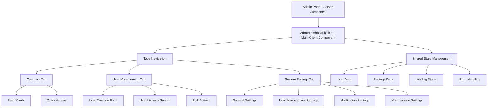
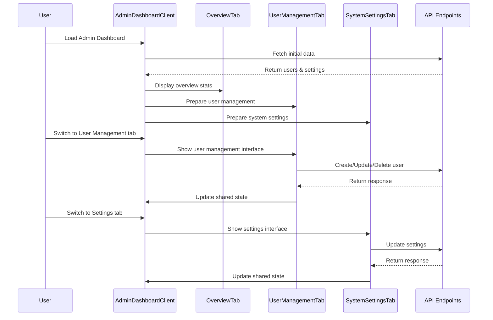
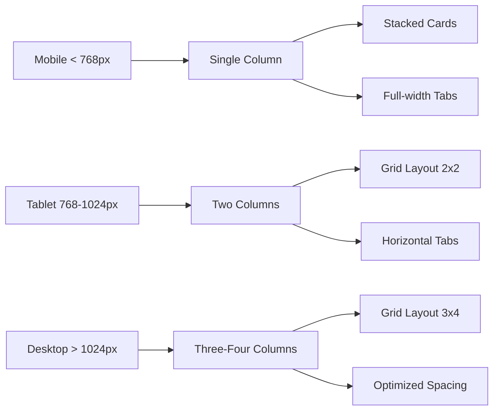

# Admin Dashboard Architecture Diagram

## Current vs New Structure Comparison

### Current Multi-Page Structure
```
/admin (page.tsx) → AdminDashboardClient → AdminUserManagement
    ↓
/admin/users (page.tsx) → AdminUsersClient
    ↓  
/admin/settings (page.tsx) → AdminSettingsClient
```

### New Single-Page Structure
```
/admin (page.tsx) → AdminDashboardClient
    ├── OverviewTab
    │   ├── StatsCards
    │   └── QuickActions
    ├── UserManagementTab
    │   ├── UserForm
    │   └── UserList
    └── SystemSettingsTab
        └── SettingsForm
```

## Component Flow Diagram



## Data Flow Architecture



## Layout Structure

```
┌─────────────────────────────────────────────────────────────┐
│ Header: Admin Dashboard                    [Logout Button]   │
├─────────────────────────────────────────────────────────────┤
│ ┌─────────┐ ┌─────────────────┐ ┌─────────────────────────┐ │
│ │Overview │ │ User Management │ │   System Settings       │ │
│ └─────────┘ └─────────────────┘ └─────────────────────────┘ │
├─────────────────────────────────────────────────────────────┤
│                                                             │
│  Tab Content Area (Scrollable)                              │
│                                                             │
│  ┌─────────────────────────────────────────────────────┐   │
│  │ Card-based layout with proper spacing and shadows   │   │
│  │                                                     │   │
│  │ ┌─────────┐ ┌─────────┐ ┌─────────┐ ┌─────────┐   │   │
│  │ │ Stat    │ │ Stat    │ │ Stat    │ │ Stat    │   │   │
│  │ │ Card 1  │ │ Card 2  │ │ Card 3  │ │ Card 4  │   │   │
│  │ └─────────┘ └─────────┘ └─────────┘ └─────────┘   │   │
│  │                                                     │   │
│  │ ┌─────────────────────┐ ┌─────────────────────────┐ │   │
│  │ │ Action Card         │ │ Action Card             │ │   │
│  │ └─────────────────────┘ └─────────────────────────┘ │   │
│  └─────────────────────────────────────────────────────┘   │
│                                                             │
└─────────────────────────────────────────────────────────────┘
```

## Responsive Design Breakpoints



## State Management Strategy

```
AdminDashboardClient (Main State)
├── users: UserProfile[]
├── settings: SystemSettings
├── loading: boolean
├── error: string | null
├── activeTab: string
└── notifications: Notification[]

Tab Components (Local State)
├── searchTerm: string
├── formData: FormState
├── selectedItems: string[]
└── modalStates: ModalState
```

## Performance Optimization Points

1. **Lazy Loading**: Load tab content only when accessed
2. **Memoization**: Cache expensive computations
3. **Debounced Search**: Reduce API calls for user search
4. **Optimistic Updates**: Update UI before API response
5. **Shared State**: Avoid duplicate data fetching
6. **Component Splitting**: Separate concerns into smaller components

## Security Considerations

1. **Server-side Auth**: Maintain existing authentication checks
2. **Role Validation**: Verify admin role on sensitive operations
3. **Input Sanitization**: Validate all form inputs
4. **API Security**: Use proper authentication headers
5. **Error Handling**: Don't expose sensitive information